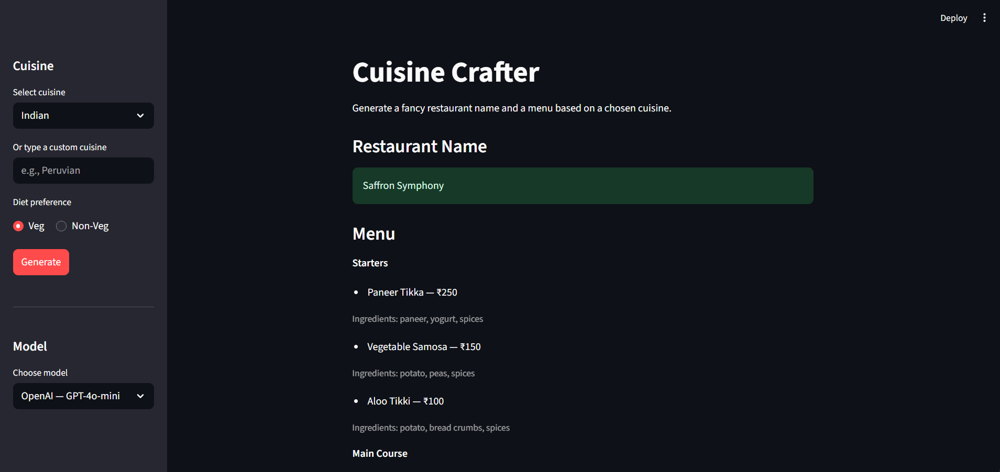

# Cuisine Crafter (Streamlit + LangChain)



Generate a fancy restaurant name and a menu from a chosen cuisine using LangChain, with a sidebar selector to choose among popular LLM providers/models. Built with Streamlit.

## Features
- Choose a cuisine or type your own
- Choose the LLM model in the sidebar (OpenAI, Anthropic, Google, Groq, Mistral, OpenRouter)
- Validates the required API key for the selected provider
- Generates a fancy restaurant name
- Generates a category wise menu items and displays them

## Quickstart

### 1) Clone and install
```bash
git clone https://github.com/viveksudani/cuisine-crafter.git
cd cuisine-crafter

# optional steps (create an activate virtual environment):
# python -m venv .venv
# .venv/Scripts/activate  # Windows PowerShell

pip install -r requirements.txt
```

### 2) Configure API key
Create a `.env` file (copy from `.env.example`) and set the API key for the provider you plan to use. The app will validate the required variable based on your model selection in the sidebar.
```bash
cp .env.example .env
# edit .env and set one of the following, depending on provider:
# OPENAI_API_KEY=...
# ANTHROPIC_API_KEY=...
# GOOGLE_API_KEY=...
# GROQ_API_KEY=...
# MISTRAL_API_KEY=...
# OPENROUTER_API_KEY=...
```

Example `.env` content for OpenAI:

```bash
OPENAI_API_KEY=sk-...
```

### 3) Run Streamlit app
```bash
streamlit run web.py
```

Open the printed local URL in your browser.

## How it works
- Uses `langchain`'s `init_chat_model` to create a chat model for the user-selected provider and model.
- Validates the corresponding API key environment variable for the chosen provider.
- Step 1: Prompt to produce a single restaurant name from the cuisine and diet.
- Step 2: Prompt to produce a structured JSON menu (parsed and rendered in the UI).
- Implemented with LangChain Runnables and a `StrOutputParser` for clean strings.

Key code is in `web.py`.

### Supported model options (sidebar)

The sidebar presents a curated list of popular models across providers:

- OpenAI — `gpt-4o-mini`, `gpt-4o`, `o3-mini` (env: `OPENAI_API_KEY`)
- Anthropic — `claude-3-5-sonnet-20240620` (env: `ANTHROPIC_API_KEY`)
- Google — `gemini-1.5-flash` (env: `GOOGLE_API_KEY`)
- Groq — `llama-3.1-70b-versatile` (env: `GROQ_API_KEY`)
- Mistral — `mistral-large-latest` (env: `MISTRAL_API_KEY`)
- OpenRouter — `anthropic/claude-3.5-sonnet` (env: `OPENROUTER_API_KEY`)

You can replace or extend these options inside the `with st.sidebar:` block in `web.py`.

